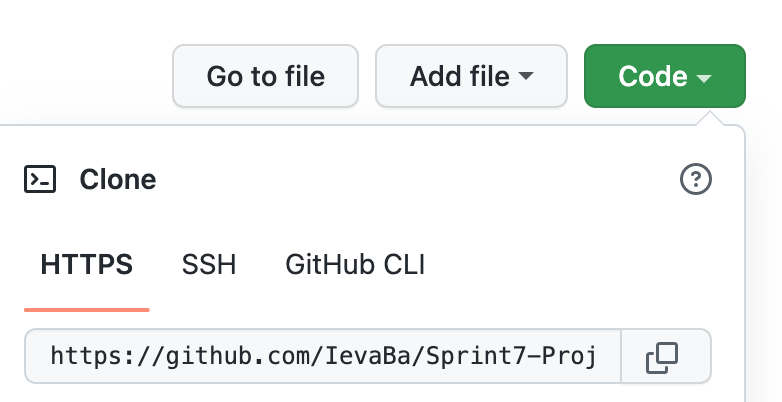
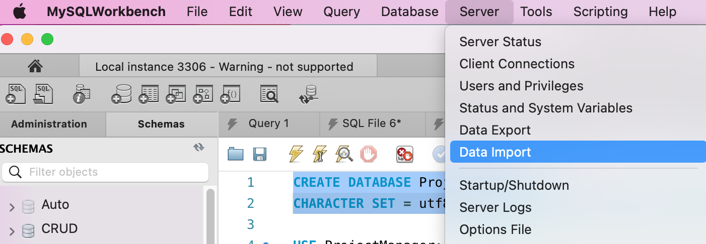
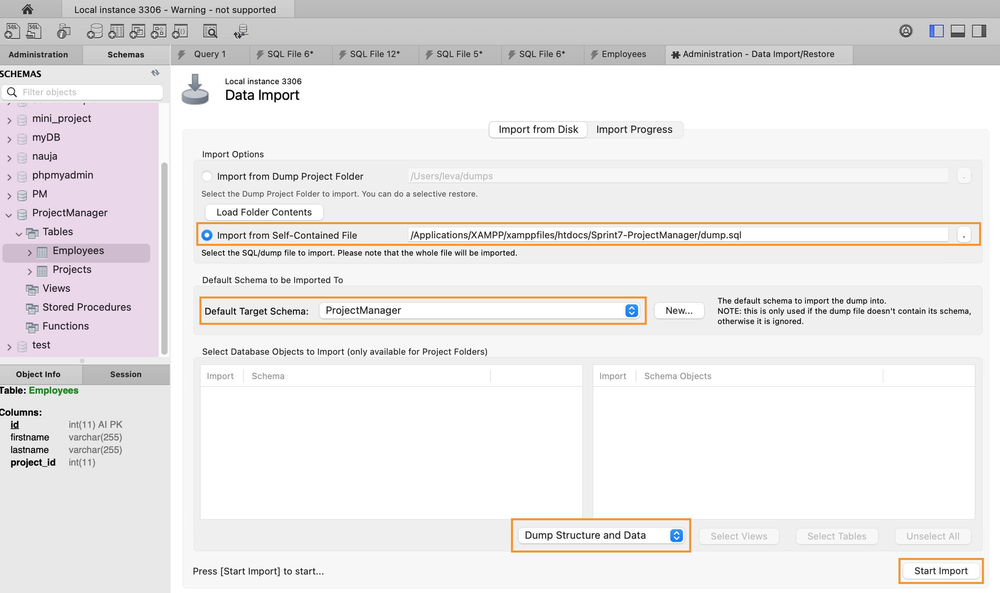

# Sprint 7 - Project manager App

## About

- Sprint 7 is a project i made while studying at BIT.
- It's an application developed in PHP language.
- Displayed data has been fetched from MySQL Workbench.
- For the main styling i used Bootstrap framework.

## Features

- This Project manager is connected with MySQL Workbench. All the changes made in the application change data in the database too, and the other way around. I used 1:M relation to link Projects and Employees. It means that one Project can have several employees working on it, but one Employee can have only one project assigned.
- In this Project manager you can:
  - Navigate through pages to see on which project the employee is working, or the list of projects and assigned employees to it.
  - Create new employee and assign a project to it as well as create a new project.
  - Delete employee and project.
  - Update employee and project records.

## Launch procedure

To run this project you will need XAMPP, MySQL Workbench and VScode.

1. Navigate to the XAMPP => htdocs directory, here you have to save this project.
2. Clone my Github repository [Sprint7-ProjectManager](https://github.com/IevaBa/Sprint7-ProjectManager)

3. Open your terminal, type `git clone`, paste the URL you copied and press Enter to create your local clone.
4. Run XAMPP and start Apache and MySQL Servers.
5. Open MySQL Workbench and create database named `ProjectManager`. Use this command: `CREATE DATABASE ProjectManager CHARACTER SET = utf8mb4 COLLATE = utf8mb4_unicode_ci;`
6. Select **Server => Data import**.

7. Choose:

- **Import from Self-Contained File** and select **dump.sql** file from cloned repository;
- **Default Target Schema** and select database you just created (`ProjectManager`);
- Make sure **Dump Structure and Data** is selected;
- Finally select **Start Import**.

8. Refresh MySQL Workbench and you should see created tables: **Employees** and **Projects**, with data.
9. Open your browser and in searchbar type `localhost/Sprint7-ProjectManager`.
10. Enjoy!

## Author

This project was created by me - Ieva Baltriukaite.

Find me on [LinkedIn](https://www.linkedin.com/in/ieva-baltriukaite-59038755/)
